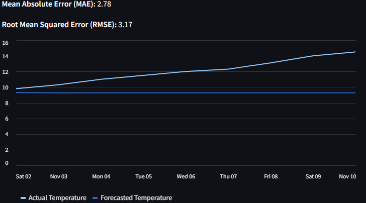

# Weather Prediction Project

This project leverages historical and live weather data to forecast future temperatures using machine learning techniques. The application employs an ARIMA model for time series forecasting and provides an interactive user interface via Streamlit to visualize results effectively.

## Features

- **Forecasting**:
  - Predict future temperatures for a user-selected horizon (up to 14 days).
  - Includes both historical and forecasted data for clear trend visualization.
- **Data Integration**:
  - Combines historical data with live weather updates fetched from OpenWeatherMap API.
- **Model Evaluation**:
  - Provides evaluation metrics such as Mean Absolute Error (MAE) and Root Mean Squared Error (RMSE) to assess model accuracy.
- **User-Friendly Interface**:
  - Simple and interactive web application built using Streamlit.
  - Slider for selecting forecast horizons and dynamic graph updates.
- **Scheduled Updates**:
  - Automatically fetches live weather data for selected cities at regular intervals using a scheduler.

## Installation

### Prerequisites
- Python 3.7 or later
- An API key from OpenWeatherMap (set up in a `.env` file)

1. **Clone the repository**:
   ```bash
   git clone https://github.com/tomnaj/weather_prediction_project.git
   cd weather_prediction_project
   ```

2. **Install dependencies**:
   ```bash
   pip install -r requirements.txt
   ```

3. **Set up environment variables**:
   - Create a `.env` file in the project directory.
   - Add your OpenWeatherMap API key:
     ```
     WEATHER_API_KEY=your_api_key_here
     ```

## Usage

1. **Run the scheduler**:
   Start the data collection scheduler to fetch live weather updates:
   ```bash
   python scheduler.py
   ```

2. **Run the application**:
   Launch the Streamlit app to view and interact with the forecasts:
   ```bash
   streamlit run main.py
   ```

3. **Interact with the application**:
   - Choose the forecast horizon (in days) using the slider.
   - View the forecasted temperatures displayed alongside historical data.

## Project Structure

- `main.py`: The main Streamlit application for visualization and interaction.
- `models/weather_model.py`: Functions for data loading, ARIMA model training, forecasting, and evaluation.
- `scheduler.py`: Fetches live weather data at regular intervals.
- `fetch_weather_data.py`: Contains functions to fetch and save weather data from the OpenWeatherMap API.
- `data/`: Stores the `weather_data.csv` file containing historical and live weather data.
- `requirements.txt`: Lists required Python packages.
- `.env`: Stores sensitive environment variables like the OpenWeatherMap API key.

## Example Output

The application provides:
- **Model Evaluation Metrics**:
  - Mean Absolute Error (MAE)
  - Root Mean Squared Error (RMSE)
- **Visualization**:
  - Historical temperatures in blue.
  - Forecasted temperatures in red.

### Example Graph:


> The graph above shows both historical and forecasted temperature trends with model accuracy metrics displayed for user reference.

## Contributing

Contributions are welcome! Open issues or submit pull requests to suggest improvements or report bugs.

## License

This project is licensed under the MIT License.
```
